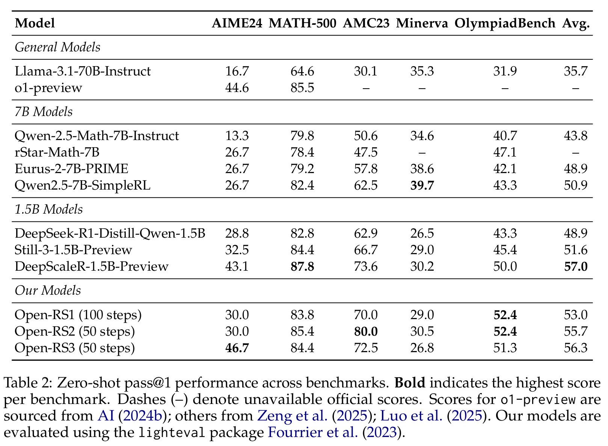
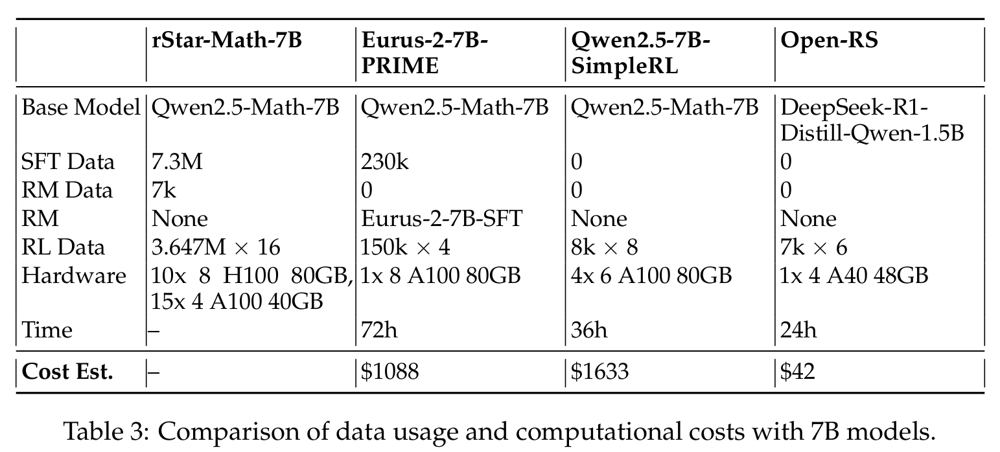
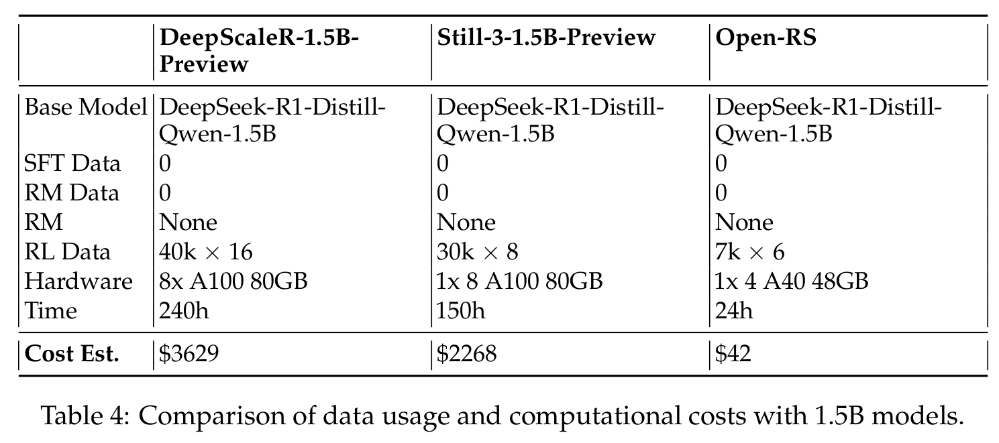

# Open RS
> Please press ⭐ button if you feel helpful!


### Datasets
- [open-s1](https://huggingface.co/datasets/knoveleng/open-s1)
- [open-deepscaler](https://huggingface.co/datasets/knoveleng/open-deepscaler)
- [open-rs](https://huggingface.co/datasets/knoveleng/open-rs) (used in Experiments 2 and 3)

## Installation

### Prerequisites
Install `uv` for managing virtual environments:
```bash
curl -LsSf https://astral.sh/uv/install.sh | sh
export PATH="$HOME/.local/bin:$PATH"
```

Set up a virtual environment with Python 3.12:
```bash
uv venv --python 3.12
source .venv/bin/activate
```

### Dependencies
Install project dependencies with `uv sync`:
```bash
uv sync --extra dev
```

> **Note**: Ensure your lockfile/environment resolves to a PyTorch version compatible with `vLLM` (the project previously used PyTorch `v2.5.1`).

Install additional dependencies based on your use case:
```bash
uv pip install -e ".[dev]"
```

### Authentication
Log in to Hugging Face and Weights & Biases:
```bash
huggingface-cli login
wandb login
```

### Git LFS
Ensure Git LFS is installed for model/dataset management:
```bash
git-lfs --version
```
If not installed:
```bash
sudo apt-get install git-lfs
```

## Training

Train models using a YAML config with 4 GPUs (set `num_processes=3`):
```bash
ACCELERATE_LOG_LEVEL=info accelerate launch \
  --config_file recipes/accelerate_configs/zero2.yaml \
  --num_processes=3 \
  src/open_r1/grpo.py \
  --config recipes/grpo.yaml
```

For Experiment 3, add the `cosine_max_len` parameter:
```bash
ACCELERATE_LOG_LEVEL=info accelerate launch \
  --config_file recipes/accelerate_configs/zero2.yaml \
  --num_processes=3 \
  src/open_r1/grpo.py \
  --config recipes/grpo.yaml \
  --cosine_max_len 3584
```

## Evaluation

Evaluate models using `lighteval` with custom tasks in `src/open_r1/evaluate.py`. For single-GPU setups:
```bash
MODEL=knoveleng/Open-RS3
MODEL_ARGS="pretrained=$MODEL,dtype=bfloat16,max_model_length=32768,gpu_memory_utilization=0.8,generation_parameters={max_new_tokens:32768,temperature:0.6,top_p:0.95}"
OUTPUT_DIR=data/evals/$MODEL

# Example: AIME 2024
TASK=aime24
lighteval vllm "$MODEL_ARGS" "custom|$TASK|0|0" \
  --custom-tasks src/open_r1/evaluate.py \
  --use-chat-template \
  --output-dir "$OUTPUT_DIR"
```

> **Important**: Set `max_model_length=32768` to match `max_new_tokens`, or `lighteval` will fail.

For multi-GPU evaluation with data parallelism:
```bash
NUM_GPUS=4
MODEL=knoveleng/Open-RS3
MODEL_ARGS="pretrained=$MODEL,dtype=bfloat16,data_parallel_size=$NUM_GPUS,max_model_length=32768,gpu_memory_utilization=0.8,generation_parameters={max_new_tokens:32768,temperature:0.6,top_p:0.95}"
TASK=aime24
OUTPUT_DIR=data/evals/$MODEL

lighteval vllm "$MODEL_ARGS" "custom|$TASK|0|0" \
  --custom-tasks src/open_r1/evaluate.py \
  --use-chat-template \
  --output-dir "$OUTPUT_DIR"
```

Alternatively, use the evaluation script:
```bash
sh eval.sh
```
Modify tasks in `eval.sh` (line 8) as needed.

### Performance Highlights
- **Open-RS1**: 53.0% avg. score
- **Open-RS2**: 55.7% avg. score, 80.0% on AMC23
- **Open-RS3**: 56.3% avg. score, 46.7% on AIME24 (outperforms `o1-preview` at 44.6%)
- Competitive MATH-500 scores; Minerva lags behind 7B models.



### Cost Efficiency
Our approach uses 7,000 samples (42,000 total outputs) and costs ~$42 on 4x A40 GPUs in 24 hours, compared to:
- 7B models: `Qwen2.5-7B-SimpleRL` ($1,633), `Eurus-2-7B-PRIME` ($1,088)
- 1.5B models: `DeepScaleR-1.5B-Preview` ($3,629), `Still-3-1.5B-Preview` ($2,268)

  


## Acknowledgements
Thanks to the Hugging Face team for their [open-r1](https://github.com/huggingface/open-r1) project.

## Citation
If this project aids your work, please cite it as:
```
@misc{dang2025reinforcementlearningreasoningsmall,
      title={Reinforcement Learning for Reasoning in Small LLMs: What Works and What Doesn't}, 
      author={Quy-Anh Dang and Chris Ngo},
      year={2025},
      eprint={2503.16219},
      archivePrefix={arXiv},
      primaryClass={cs.LG},
      url={https://arxiv.org/abs/2503.16219}, 
}
```
